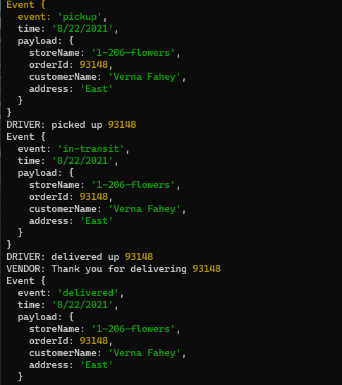
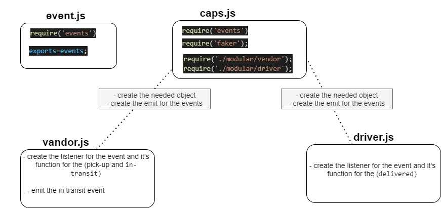

# Lab: Class 11

## caps

### Author: Razan Alamleh

### Setup
- .env requirements
  - STORE_NAME= 1-206-flowers

### Running the app
- node caps.js

    - Returns Object

    

### Tests
- Unit Tests: npm run test

### UML

### Notes
- pull request : https://github.com/Razan-am/caps/pull/1
- How do I install the app or library?
  - Clone the repo to your local machine
  - in the terminal, `run npm i`
  - Create `.env` file with port name as the one in the `env samples` 
  - run node caps.js to see the  return result  

- How do I test the app or library?
1.  in the termenal run `node caps.js`

